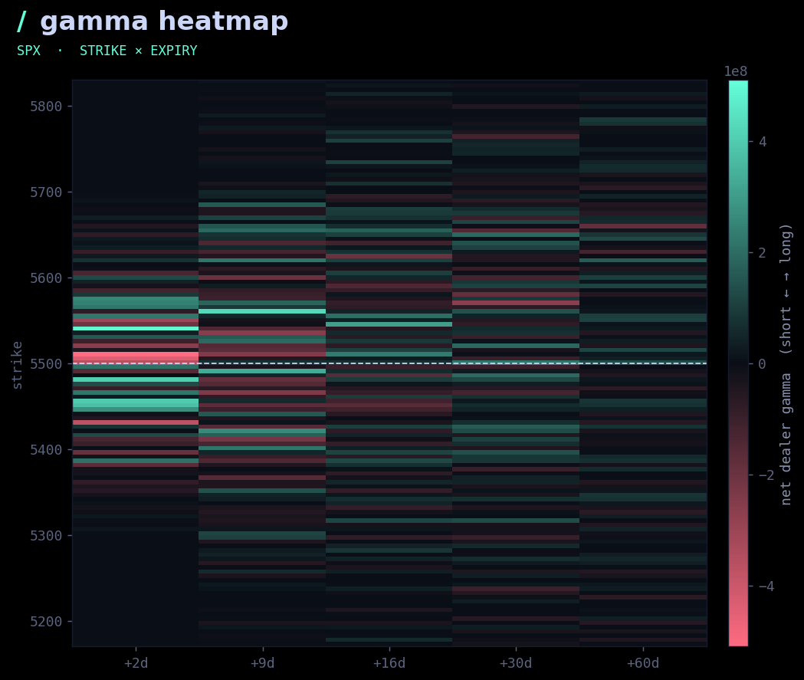

# Gamma Exposure Heatmap

A color-coded heatmap of **net dealer gamma exposure** across every strike and
expiry. One glance shows where positioning is concentrated, how it changes along
the term structure, and where the long-/short-gamma boundary sits vs. spot.




## Stack

```
backend/    Flask API (Python)
  app.py          /api/heatmap + serves the built frontend
  heatmap.py      strike x expiry gamma-exposure grid
  bs.py           Black-Scholes gamma (NumPy)
  marketdata.py   options-chain layer (synthetic by default; CBOE hook)
frontend/   React + Vite
  src/App.jsx           page shell
  src/components/        Heatmap (canvas + hover tooltip)
  src/theme.css         site-matched dark/mint theme
```

## Run it

```bash
# backend (port 5001)
cd backend && pip install -r requirements.txt && python app.py

# frontend (port 5173, hot reload)
cd frontend && npm install && npm run dev
```

A production build ships in `frontend/dist`, so running just the backend and
opening **http://127.0.0.1:5001** serves the built app. Rebuild with
`cd frontend && npm run build`.

## Live data

```bash
export CBOE_TOKEN=...     # then implement _from_cboe in backend/marketdata.py
```

## API

`GET /api/heatmap` → `{ spot, strikes:[...], expiries:[...], z:[[...]], vmax }`

## Notes

Educational tool, not trading advice.
